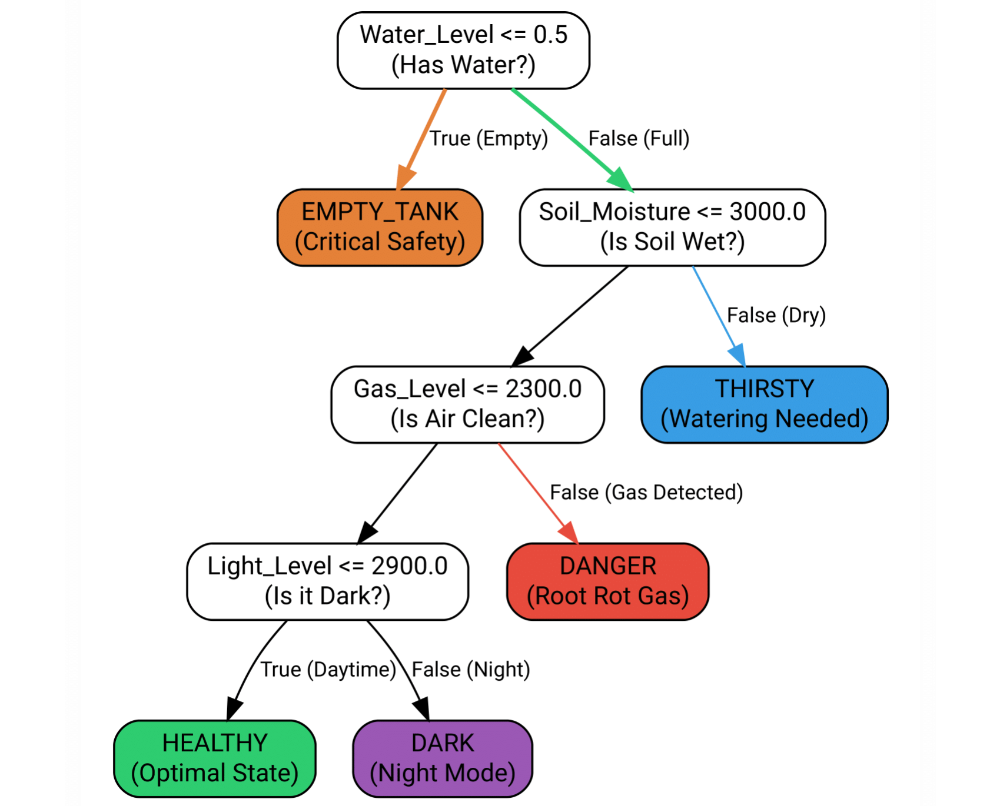
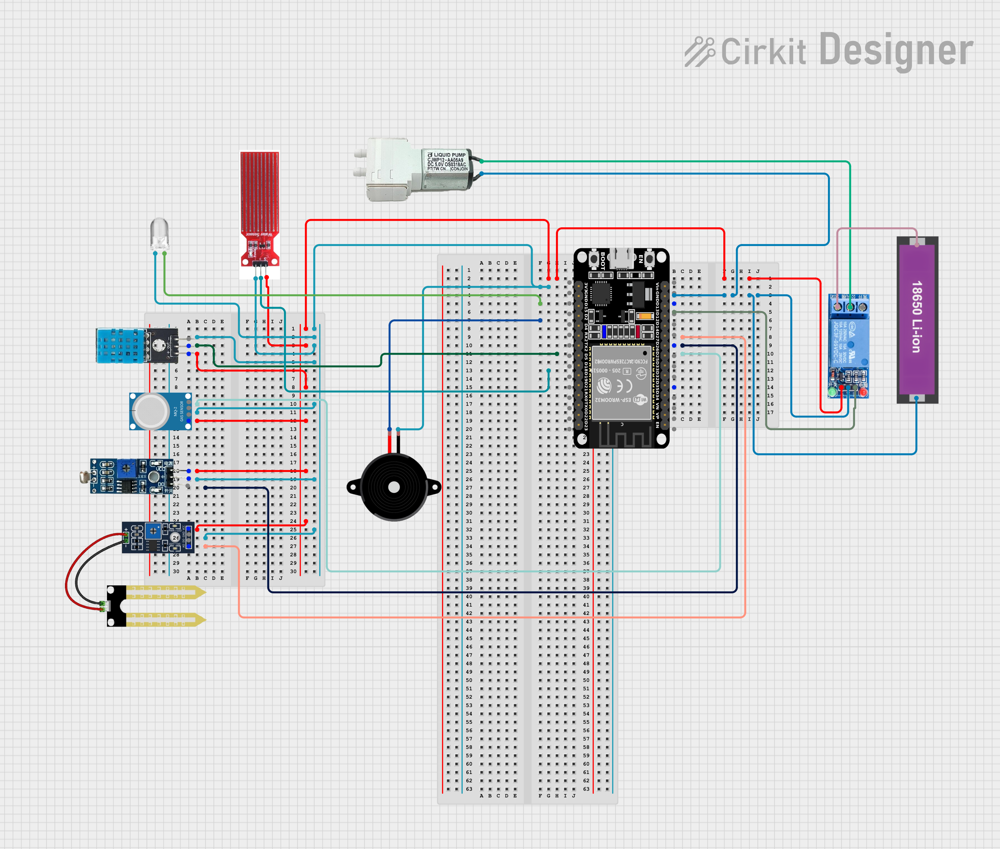

# 🌱 AI-Driven Smart Garden System (IoT + ML)
> An autonomous plant care system powered by ESP32 and Edge Machine Learning.

## 📖 Overview
This project is an intelligent ecosystem designed to automate the care of sensitive plants (specifically the **Panda Plant** / *Kalanchoe tomentosa*). Unlike traditional irrigation systems that use fixed timers, this system uses a **Decision Tree Classifier** trained on real-world sensor data to make decisions based on the plant's specific biological needs.

## 🚀 Key Features
- **🧠 Edge ML Logic:** Runs a decision tree model locally on the ESP32 to classify plant health (Healthy, Thirsty, Root Rot Risk, etc.).
- **💧 Smart Irrigation:** Pulse-dosing water algorithm that prevents over-watering.
- **🛡️ Hardware Safety:** "Auto-Lock" feature prevents pump burnout if the water tank is empty.
- **🌐 Real-Time Dashboard:** Asynchronous Web Interface (AJAX) hosted on the chip for monitoring and control.
- **☀️ Circadian Lighting:** Automates grow lights based on Day/Night cycles using NTP time sync.

## 🛠️ Tech Stack
- **Hardware:** ESP32 DevKit V1, DHT11, Capacitive Soil Sensor, LDR, MQ-2 Gas Sensor, Relay, 5V Pump.
- **Firmware:** C++ (Arduino Framework).
- **Data Science:** Python (Pandas & Scikit-Learn) used for dataset analysis and threshold extraction.
- **Web:** HTML5, CSS3, JavaScript (Embedded).

## 📊 The ML Model
The system was trained on a custom dataset (`data/training_data.csv`) to derive the following decision logic:

1. **Water Safety Check:** Is the tank empty?
2. **Soil Analysis:** Is moisture < 3000 (Dry) or < 1600 (Wet)?
3. **Air Quality:** Are VOCs > 2300 (Root Rot indication)?
4. **Light Check:** Is it Night time or Day time?

## 🔌 Circuit Diagram

## 🔮 Future Scope
- Integration with AWS IoT Core for cloud logging.
- Camera module for visual leaf disease detection.
- Mobile App using React Native.
