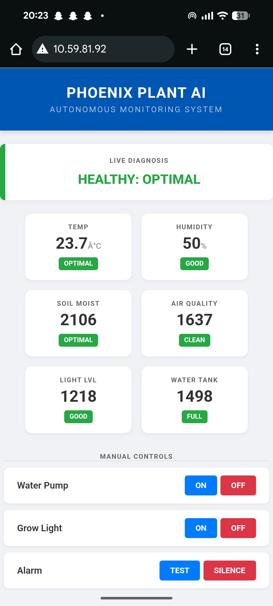

# 🌱 ESP32 EdgeAI Smart Garden Monitor
> **Autonomous Plant Care System powered by Edge Machine Learning & IoT**



## 📖 Project Overview
This project is an advanced **AI-Driven Smart Garden** designed to automate the care of sensitive plants, utilizing the **Panda Plant** (*Kalanchoe tomentosa*) as a reference model.

Unlike standard irrigation systems that use fixed timers, this system utilizes a **Decision Tree Classifier** trained on real-world sensor data (`data/training_data.csv`). It runs purely on the **ESP32 microcontroller (Edge Computing)** to make real-time decisions about watering, lighting, and safety without relying on the cloud.

## 🚀 Key Features
* **🧠 Edge ML Engine:** Implements a C++ decision tree derived from Python analysis to classify plant health (Healthy, Thirsty, Root Rot Risk, etc.).
* **💧 Precision Auto-Watering:** Uses a "Pulse Dosing" algorithm to water only when soil is critically dry (succulent-specific logic: Soil > 3800).
* **🛡️ Hardware Safety Interlock:** Prevents water pump operation if the tank is empty (`Water Level < 1000`), protecting hardware from burnout.
* **⚠️ Root Rot Prevention:** Monitors Volatile Organic Compounds (VOCs) using an MQ-2 sensor to detect soil rot gases before visual symptoms appear.
* **🌐 Real-Time Telemetry:** Features a responsive, asynchronous (AJAX) web dashboard hosted directly on the ESP32.
* **☀️ Circadian Lighting:** Syncs with NTP (Internet Time) to provide grow lights during the day but ensure darkness at night.

## 📂 Repository Structure
```text
ESP32-EdgeAI-Garden-Monitor/
├── src/
│   └── SmartGarden_Final.ino      # Main C++ Firmware for ESP32
├── data/
│   └── training_data.csv          # Dataset used to train the ML model
├── scripts/
│   └── train_model.py             # Python script used to extract ML rules
├── diagrams/
│   ├── circuit_diagram.png        # Wiring connections
│   ├── ml_decision_tree.png       # Visual representation of AI logic
│   ├── web_dashboard.png          # UI Screenshot
│   └── hardware_setup.jpg         # Photo of the physical device
└── README.md                      # Project Documentation
🛠️ Tech Stack
Microcontroller: ESP32 DOIT DEVKIT V1

Sensors: DHT11 (Temp/Hum), Capacitive Soil Moisture, LDR (Light), MQ-2 (Gas), Water Level Sensor.

Actuators: 5V Relay (Pump), Piezo Buzzer, Grow LED.

Firmware: C++ (Arduino IDE).

Data Analysis: Python (Pandas, Scikit-Learn) for threshold extraction.

Web Interface: HTML5, CSS3, JavaScript (AJAX).

📊 The Machine Learning Logic
The system's decision logic was trained offline using the dataset in the data/ folder. The Decision Tree structure classifies the plant's state based on the following priorities:

Decision Thresholds (Panda Plant Protocol):

CRITICAL SAFETY: Is the Water Tank empty (< 1000)? → Lock Pump & Alert.

SOIL HEALTH: Is moisture > 3800 (Very Dry)? → Water. Is it < 1600 (Wet)? → Stop.

AIR QUALITY: Is Gas > 2400? → Trigger "Root Rot" Danger Alert.

ENVIRONMENT: Is it Night time? → Turn off Lights.

🔌 Circuit Diagram
Follow this wiring diagram to replicate the hardware setup:

Pin Mapping:

Relay (Pump): GPIO 26

DHT11: GPIO 4

Soil Sensor: GPIO 34 (Analog)

LDR: GPIO 35 (Analog)

MQ-2 Gas: GPIO 32 (Analog)

Water Level: GPIO 33

Buzzer: GPIO 19

LED: GPIO 21

📸 Hardware Prototype
🔮 Future Scope
Integration with MQTT/AWS IoT Core for historical data logging.

Adding a camera module (ESP32-CAM) for visual leaf disease detection.

Developing a mobile app using React Native.
